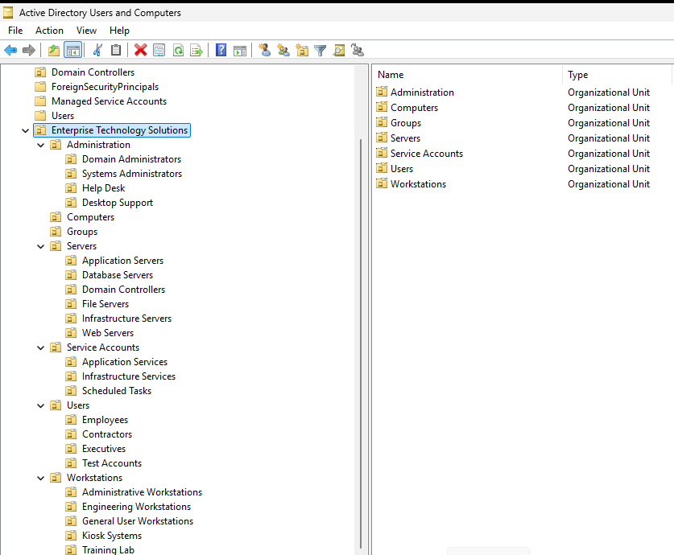

# Enterprise Technology Solutions Windows Lab

> A hands-on enterprise Windows Server administration lab documenting Active Directory, identity administration, infrastructure standards, PowerShell, troubleshooting, and operational best practices.

## Project Overview

The **Enterprise Technology Solutions Windows Lab** simulates the responsibilities of a Windows Systems Administrator supporting an enterprise environment.

Rather than presenting isolated exercises, this repository documents a growing infrastructure environment through:

- Infrastructure assessment and design
- Active Directory administration
- Identity and access management
- PowerShell administration and automation
- Configuration validation
- Technical documentation
- Git and GitHub version control
- Enterprise operational standards

Each change is designed, implemented, validated, documented, and maintained through a controlled Git workflow.

## Professional Objective

This project supports my transition from **Business Systems Analyst** to **Windows Systems Administrator** while building the technical and architectural foundation required for future infrastructure engineering and enterprise solutions architecture roles.

## Lab Environment

| Component | Configuration |
|---|---|
| Virtualization platform | VMware Workstation |
| Operating system | Windows Server 2025 Standard Evaluation |
| Primary server | `SERVER01` |
| Active Directory domain | `corp.enterpriseit.local` |
| Organization | Enterprise Technology Solutions |
| Directory services | Active Directory Domain Services |
| DNS | Active Directory-integrated DNS |
| Administration tools | Server Manager, ADUC, and PowerShell |
| Version control | Git |
| Repository hosting | GitHub |

## Enterprise Directory Structure

The Active Directory environment uses a purpose-built Organizational Unit structure designed to support delegated administration, Group Policy, security boundaries, identity lifecycle management, and future expansion.

```text
corp.enterpriseit.local
└── Enterprise Technology Solutions
    ├── Administration
    ├── Computers
    ├── Groups
    ├── Servers
    ├── Service Accounts
    ├── Users
    │   ├── Employees
    │   ├── Contractors
    │   ├── Executives
    │   └── Test Accounts
    └── Workstations
```

### Organizational Unit Implementation



## Documentation

### Module Documentation

| Document | Focus |
|---|---|
| [Project Overview](docs/modules/01-project-overview.md) | Project purpose, objectives, and environment |
| [SERVER01 Assessment](docs/modules/02-server01-assessment.md) | Server roles, configuration, and baseline assessment |
| [Active Directory OU Design](docs/modules/03-active-directory-ou-design.md) | Organizational Unit architecture and design decisions |
| [User Account Administration](docs/modules/04-user-account-administration.md) | User provisioning and identity administration |
| [Security Groups and RBAC](docs/modules/05-security-groups-and-rbac.md) | Security groups, authorization, and role-based access control |

### Repository Standards

| Document | Purpose |
|---|---|
| [Documentation Standards](docs/standards/documentation-standards.md) | Requirements for consistent technical documentation |
| [Naming Conventions](docs/standards/naming-conventions.md) | Standards for accounts, groups, files, and infrastructure objects |
| [Contributing Guidelines](CONTRIBUTING.md) | Repository contribution and change workflow |
| [Changelog](CHANGELOG.md) | Record of notable project changes |

## Skills Demonstrated

- Windows Server administration
- Active Directory Domain Services
- Organizational Unit design and implementation
- User account provisioning
- Security group administration
- Role-Based Access Control
- DNS administration
- PowerShell administration
- Infrastructure assessment and validation
- Technical documentation
- Git and GitHub version control
- Enterprise troubleshooting methodology

## PowerShell

PowerShell commands introduced during the project include:

```powershell
Import-Module ActiveDirectory

Get-ADUser
New-ADUser
Set-ADUser
Enable-ADAccount
Set-ADAccountPassword
Get-ADOrganizationalUnit
```

Future modules will expand from individual administrative commands into repeatable scripts and automation.

## Repository Structure

```text
enterprise-technology-solutions-windows-lab/
├── README.md
├── CHANGELOG.md
├── CONTRIBUTING.md
├── docs/
│   ├── architecture/
│   ├── decisions/
│   ├── modules/
│   ├── references/
│   ├── standards/
│   └── troubleshooting/
├── powershell/
│   ├── active-directory/
│   └── server-administration/
├── screenshots/
├── diagrams/
├── reports/
└── labs/
```

## Current Progress

Completed work includes:

- Windows Server virtual lab deployment
- Enterprise Active Directory assessment
- Organizational Unit design and implementation
- Enterprise user hierarchy creation
- Active Directory PowerShell module validation
- User account provisioning
- Security group creation
- Repository standards and naming conventions
- GitHub repository publication and protection

### Current Focus

The current project work focuses on:

- Enterprise identity administration
- User lifecycle management
- Security groups
- Role-Based Access Control
- Authentication and authorization
- PowerShell administration

## Planned Development

Future modules will address:

- AGDLP access-control implementation
- Group Policy
- File servers and shared folders
- NTFS permissions
- Distributed File System
- DHCP
- Certificate Services
- PowerShell automation
- Backup and recovery
- Windows security hardening
- Infrastructure monitoring
- Enterprise troubleshooting
- Azure hybrid integration

## Methodology

This project uses small, controlled changes that are individually documented and validated. Repository updates follow a professional feature-branch workflow:

1. Create a focused branch.
2. Make and validate the change.
3. Commit the completed work.
4. Publish the branch.
5. Review the change through a pull request.
6. Squash-merge the approved change into `main`.
7. Synchronize the local repository.

## Reference Material

Primary reference:

*The Practice of System and Network Administration, Volume 1: DevOps and Other Best Practices for Enterprise IT, Third Edition*

Additional guidance is drawn from Microsoft Learn documentation and enterprise infrastructure administration resources.