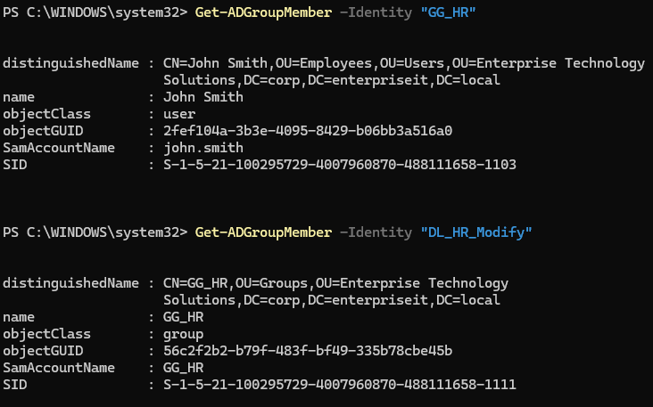
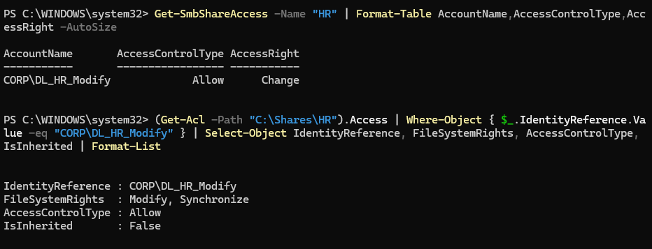

# Security Groups, RBAC, and AGDLP Access Control

## Purpose

This document records the implementation and validation of role-based access control (RBAC) for the Human Resources file share in the Enterprise Technology Solutions Windows lab.

The implementation uses the Account–Global Group–Domain Local Group–Permission (AGDLP) model to separate employee identity, business roles, resource-access groups, and technical permissions.

## Business Context

Enterprise file shares may contain sensitive Human Resources records, controlled technical publications, maintenance documentation, or other business information that must be restricted to authorized personnel.

Access should be based on an employee’s organizational role rather than assigned directly to an individual account. Role-based assignment makes access easier to administer, review, modify, and remove throughout the employee lifecycle.

This lab uses the following protected network resource:

```text
\\SERVER01\HR
```

The corresponding local folder is:

```text
C:\Shares\HR
```

## Access-Control Design

The implemented AGDLP chain is:

```text
John Smith
    ↓
GG_HR
    ↓
DL_HR_Modify
    ↓
SMB Change and NTFS Modify
    ↓
\\SERVER01\HR
```

The components serve different administrative purposes:

| Component | Type | Purpose |
|---|---|---|
| John Smith | User account | Represents an individual employee |
| `GG_HR` | Global security group | Represents the Human Resources business role |
| `DL_HR_Modify` | Domain Local security group | Represents Modify-level access to the HR resource |
| `\\SERVER01\HR` | SMB share | Provides network access to the protected folder |
| `C:\Shares\HR` | NTFS folder | Enforces file-system permissions on the resource |

## Role-Based Access Control

John Smith was assigned to `GG_HR` because he represents an employee performing an authorized Human Resources role.

`GG_HR` was then nested inside `DL_HR_Modify`. Permissions were assigned to the Domain Local group rather than directly to John Smith or the Global group.

This design allows administrators to manage access by changing business-role membership without repeatedly modifying permissions on the protected resource.

Jane Doe was intentionally left outside `GG_HR` so the access-control design could be tested with an unauthorized user.

## Permission Configuration

The following permissions were assigned to `CORP\DL_HR_Modify`:

| Permission layer | Access type | Permission |
|---|---|---|
| SMB share | Allow | Change |
| NTFS folder | Allow | Modify and Synchronize |

The NTFS permission is explicit rather than inherited.

The broad `Everyone` entry was removed from the SMB share permissions. No Deny permissions were configured.

Windows evaluates both SMB share and NTFS permissions during network access. Effective access is determined by the most restrictive combination of the two permission layers.

## Functional Validation

### Authorized Access Test

John Smith authenticated using the `john.smith` domain account and accessed:

```text
\\SERVER01\HR
```

The authorized-user test confirmed that he could:

- Create a file
- Read the file
- Modify the file
- Delete the file

This validated the complete authorized-access chain:

```text
john.smith → GG_HR → DL_HR_Modify → HR resource permissions
```

### Unauthorized Access Test

Jane Doe authenticated using the `jane.doe` domain account but was not a member of `GG_HR`.

The unauthorized-user test confirmed that she could not:

- Browse the HR share
- Read its contents
- Create a file in the share

Both attempts returned an `Access is denied` result. A local-path verification confirmed that the failed write attempt did not create an unauthorized file.

### Account-Security Cleanup

The **User must change password at next logon** setting was temporarily cleared to permit controlled network-authentication testing.

After testing, the requirement was restored for both accounts. A directory-side Lightweight Directory Access Protocol (LDAP) query confirmed that:

- Both accounts remained enabled
- `PasswordNeverExpires` remained disabled
- `pwdLastSet` equaled zero for both accounts

This returned the test accounts to their approved password-security baseline.

## Operational Risks and Controls

| Operational risk | Implemented control |
|---|---|
| Direct permissions assigned to individual employees | Permissions assigned through role and resource groups |
| Unauthorized access to sensitive information | Membership-based authorization and negative access testing |
| Excessive permissions | Change and Modify used instead of Full Control |
| Broad access through default share permissions | `Everyone` removed from the SMB share |
| Conflicting SMB and NTFS permissions | Both permission layers independently validated |
| Temporary testing exceptions left in place | Password-change requirements restored and verified |
| Undetected access-control failure | Positive and negative functional tests completed |

## Systems Administrator Responsibilities

A Systems Administrator supporting this access-control model is responsible for:

- Translating approved business roles into security-group membership
- Applying least-privilege permissions
- Avoiding direct user-to-resource permission assignments
- Maintaining consistent group-naming standards
- Validating both SMB and NTFS permissions
- Testing authorized and unauthorized access
- Removing temporary testing exceptions
- Reviewing group membership when employees change roles or leave the organization
- Maintaining professional implementation and validation records

In a production environment, administrators must also evaluate required access for backup systems, service accounts, security tools, and administrative support personnel before removing broad share permissions.

## Validation Evidence

### AGDLP Group Nesting



### SMB and NTFS Permissions



## Implementation Outcome

The implementation demonstrated that AGDLP provides a structured and scalable method for managing enterprise resource access.

Authorized access was successfully granted through business-role membership, unauthorized access was denied, both permission layers were validated, and temporary testing changes were securely reversed.