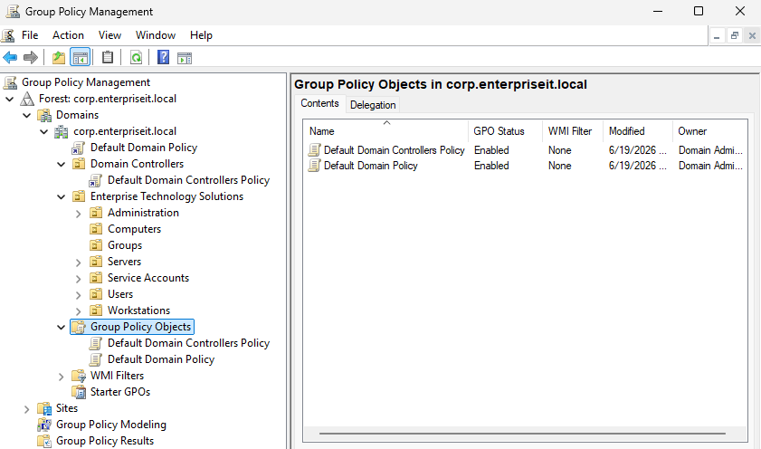
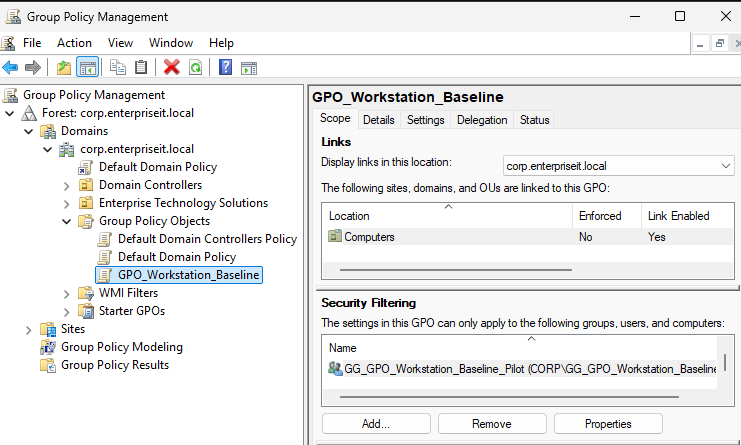
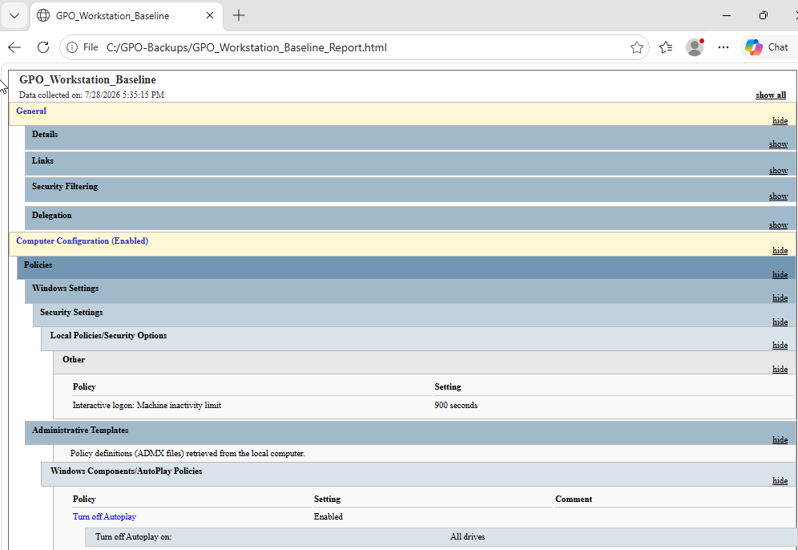

# Group Policy Administration

## Purpose

This module implemented and validated a computer-based Group Policy Object for the Enterprise Technology Solutions Windows domain. The objective was to establish a controlled workstation baseline while practicing policy configuration, OU linking, security filtering, inheritance management, troubleshooting, backup, and recovery.

## Environment

- Domain: `corp.enterpriseit.local`
- Domain controller: `SERVER01`
- Domain client: `CLIENT01`
- Target OU: `Enterprise Technology Solutions/Computers`
- Pilot child OU: `Pilot Workstations`
- GPO: `GPO_Workstation_Baseline`
- Security-filtering group: `GG_GPO_Workstation_Baseline_Pilot`

## Workstation Baseline Configuration

The following computer-security settings were configured:

| Policy setting | Configuration | Administrative purpose |
|---|---|---|
| Turn off AutoPlay | Enabled for all drives | Reduces the risk of automatically executing unwanted content from removable media |
| Interactive logon: Machine inactivity limit | 900 seconds | Automatically locks an inactive workstation after 15 minutes |

The GPO was linked to the custom `Computers` OU so that workstation policies could be managed separately from server and user policies.

## Security Filtering

The GPO initially used `Authenticated Users` for testing. A dedicated pilot group was then created to provide controlled deployment:

```text
GG_GPO_Workstation_Baseline_Pilot
```

The `CLIENT01` computer account was added to this group. Security filtering on the GPO was changed so that only members of the pilot group received the workstation baseline.

This approach supports phased deployment by allowing administrators to validate a policy on selected computers before expanding it to a broader production population.

## Policy Validation

Policy application was validated on `CLIENT01` using:

```powershell
gpupdate /force
gpresult /r /scope computer
```

The results confirmed that:

- `GPO_Workstation_Baseline` applied successfully.
- `Default Domain Policy` applied through normal domain inheritance.
- `CLIENT01` received the workstation baseline through the pilot security group.
- The configured AutoPlay and inactivity-limit settings were active.

Active Directory group membership and GPO permissions were also verified using PowerShell:

```powershell
Get-ADGroupMember -Identity 'GG_GPO_Workstation_Baseline_Pilot'

Get-GPPermission -Name 'GPO_Workstation_Baseline' `
    -TargetName 'GG_GPO_Workstation_Baseline_Pilot' `
    -TargetType Group
```

The permission result showed `GpoApply`, confirming that the pilot group could read and apply the GPO.

## Inheritance and Enforcement Testing

`CLIENT01` was moved into the `Pilot Workstations` child OU to test Group Policy inheritance safely.

The test demonstrated that:

1. A child OU normally inherits policies linked to its parent OU.
2. Enabling **Block Inheritance** prevented ordinary inherited GPOs from reaching the child OU.
3. Setting the workstation-baseline link to **Enforced** allowed it to override Block Inheritance.
4. The non-enforced `Default Domain Policy` remained blocked during the test.
5. Removing Block Inheritance and Enforced restored normal policy processing.

The temporary test configuration was removed after validation.

## Backup and Recovery Validation

The active workstation-baseline GPO was backed up to:

```text
C:\GPO-Backups
```

The backup included the comment:

```text
Validated Module 10 workstation baseline
```

Group Policy Management confirmed that the backup was readable and associated with the correct domain and GPO.

To test recovery safely, the backup was imported as a separate unlinked GPO:

```text
GPO_Workstation_Baseline_Restore_Test
```

The recovered GPO contained the expected AutoPlay and machine-inactivity settings. Because it was not linked to an Active Directory container, it could not affect `CLIENT01`.

The temporary recovery-test GPO was deleted after successful validation, while the active GPO and backup were retained.

## Administrative Lessons

This module demonstrated that effective Group Policy administration requires more than configuring policy settings. Administrators must also:

- Link GPOs to the correct Active Directory containers.
- Limit initial deployment through security filtering.
- Understand inheritance, Block Inheritance, and Enforced links.
- Validate actual client-side results rather than relying only on server-side configuration.
- Back up validated policies before making additional changes.
- Test recovery without affecting the active production policy.
- Remove temporary test objects after validation.
- Maintain documentation and focused evidence for operational accountability.

## Evidence

### Initial Group Policy Environment



### Workstation Baseline Scope and Security Filtering



### Workstation Baseline Policy Settings



## Outcome

A validated and recoverable workstation-baseline GPO is now deployed to `CLIENT01` through controlled security filtering. The completed configuration demonstrates practical competency in Group Policy design, deployment, validation, inheritance management, backup, recovery testing, and operational documentation.