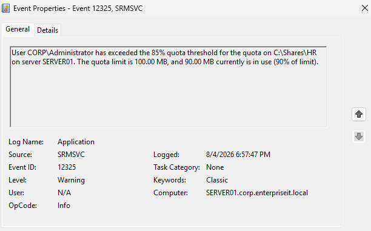
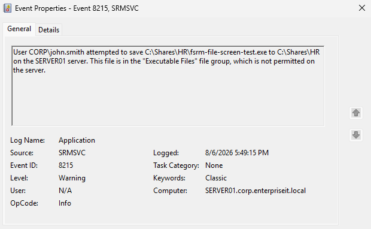
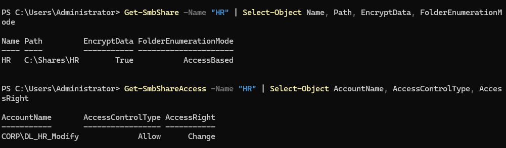
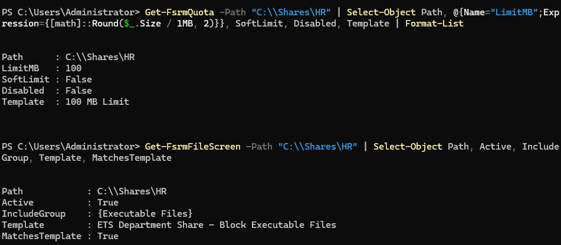

# Windows File Services Administration

## 1. Module Overview

This module implemented and validated secure Windows file services for the Enterprise Technology Solutions Human Resources department.

The implementation extended the existing Active Directory authorization model by adding SMB security controls, restricted-folder access, File Server Resource Manager quotas, and active file screening.

The completed file-service environment provides:

- Group-based access through AGDLP.
- Layered SMB share and NTFS permissions.
- SMB encryption for data transmitted across the network.
- Access-Based Enumeration for improved information privacy.
- Restricted access to confidential HR information.
- Storage enforcement through a hard quota.
- Event Log notification when storage reaches a defined threshold.
- Active blocking of executable file types.
- Auditable validation through PowerShell and Windows Event Viewer.

## 2. Enterprise Context

Windows file services provide centralized storage that can be secured, monitored, backed up, and administered consistently.

Enterprise file-service administration requires more than creating a shared folder. Administrators must determine:

- Who should access the resource.
- What level of access each role requires.
- How permissions will be maintained as personnel change.
- How data will be protected while crossing the network.
- Whether unauthorized users should be able to discover restricted folders.
- How storage consumption will be controlled.
- Which file types are appropriate for the resource.
- How policy violations and capacity conditions will be recorded.

The HR share represents a business resource containing potentially sensitive personnel information. Its design therefore emphasizes least privilege, role-based authorization, information privacy, storage governance, and operational accountability.

## 3. Design Considerations

### Group-Based Authorization

Access was assigned through the Accounts, Global Groups, Domain Local Groups, Permissions model rather than directly to individual users.

The primary HR access chain is:

```text
User account
    ↓
GG_HR
    ↓
DL_HR_Modify
    ↓
SMB Change and NTFS Modify
    ↓
\\SERVER01\HR
```

This separates business-role membership from resource permissions. Employee access can be changed by updating role-group membership without redesigning the file-share permissions.

### Layered Permissions

Network access to the share is governed by both SMB share permissions and NTFS permissions.

- SMB permissions control access through the network share.
- NTFS permissions control access to folders and files on the filesystem.
- Effective network access is determined by the most restrictive applicable combination.

`Change` was used at the SMB layer and `Modify` at the NTFS layer to support normal departmental work without granting unnecessary Full Control.

### Restricted-Folder Design

The `Confidential` subfolder required more restrictive access than the root HR share. A dedicated authorization chain was used:

```text
Authorized account
    ↓
GG_HR_Confidential
    ↓
DL_HR_Confidential_Modify
    ↓
NTFS Modify
    ↓
C:\Shares\HR\Confidential
```

This design allows the organization to maintain general HR access separately from confidential-data access.

### Storage and File-Type Governance

File Server Resource Manager was selected to provide:

- A reusable hard-quota template.
- An 85% capacity-warning threshold.
- Event Log notification without dependency on an unconfigured SMTP service.
- Active file screening to prevent executable files from being stored in the departmental share.

## 4. Implementation

### Environment

| Component | Configuration |
|---|---|
| Domain | `corp.enterpriseit.local` |
| File server | `SERVER01` |
| Client | `CLIENT01` |
| Share name | `HR` |
| Local path | `C:\Shares\HR` |
| UNC path | `\\SERVER01\HR` |
| Primary access group | `CORP\DL_HR_Modify` |
| Restricted folder | `C:\Shares\HR\Confidential` |

### SMB Share Security

The `HR` share was configured with:

- SMB encryption enabled.
- Access-Based Enumeration enabled.
- `CORP\DL_HR_Modify` granted Change access.
- Administrative access retained as required.
- Broad default access removed.

SMB encryption protects file-service traffic while it travels between the client and server.

Access-Based Enumeration hides folders and files that a user cannot access. It improves privacy and reduces unnecessary information exposure, but it does not replace NTFS permissions.

### NTFS and AGDLP Authorization

NTFS permissions were aligned with the SMB authorization model.

The design uses:

- Global groups to represent business roles.
- Domain Local groups to represent resource permissions.
- NTFS permissions assigned to the Domain Local groups.
- No direct permission assignments to individual users.

The `Confidential` folder uses its own Global and Domain Local groups so that confidential access can be managed independently from ordinary HR access.

### File Server Resource Manager

The File Server Resource Manager role service was installed on `SERVER01`.

The following reusable quota template was created:

```text
ETS Department Share - 100 MB Hard Limit
```

The template was applied to:

```text
C:\Shares\HR
```

Its configuration includes:

| Setting | Value |
|---|---|
| Quota type | Hard quota |
| Limit | 100 MB |
| Warning threshold | 85% |
| Notification action | Event Log warning |
| Email action | Disabled |

A hard quota prevents the managed path from exceeding its assigned capacity. This differs from a soft quota, which monitors usage but does not block additional writes.

### Active File Screening

The built-in `Executable Files` file group was reviewed without modification.

The following reusable file-screen template was created:

```text
ETS Department Share - Block Executable Files
```

The template uses:

- Active screening.
- The built-in `Executable Files` group.
- Event Log notification.
- No email, command, or report actions.

The active file screen was applied to:

```text
C:\Shares\HR
```

Because the screen is active, matching filenames are blocked rather than merely reported. File screening evaluates filename patterns and does not inspect file contents or replace endpoint security software.

### Administrative Tools and Commands

The implementation and validation used:

- File Server Resource Manager
- Server Manager
- File Explorer
- Active Directory administrative tools
- Windows Event Viewer
- PowerShell
- `fsutil`

Representative read-only validation commands included:

```powershell
Get-SmbShare -Name "HR" |
    Select-Object Name, Path, EncryptData, FolderEnumerationMode
```

```powershell
Get-SmbShareAccess -Name "HR" |
    Select-Object AccountName, AccessControlType, AccessRight
```

```powershell
Get-FsrmQuota -Path "C:\Shares\HR"
```

```powershell
Get-FsrmFileScreen -Path "C:\Shares\HR"
```

```powershell
Test-Path "\\SERVER01\HR\fsrm-file-screen-test.exe"
```

## 5. Validation

Positive and negative tests were used to confirm that the controls enforced the intended policy without preventing legitimate activity.

| Validation | Expected result | Result |
|---|---|---|
| Authorized HR access | Authorized user can work with permitted files | Passed |
| Unauthorized access | User without the required group membership is denied | Passed |
| SMB encryption | `EncryptData` reports `True` | Passed |
| Access-Based Enumeration | Mode reports `AccessBased` | Passed |
| Quota threshold | Crossing 85% generates an Event Log warning | Passed |
| Hard-quota enforcement | A write exceeding 100 MB is rejected | Passed |
| Executable-file screen | An `.exe` filename is rejected | Passed |
| Permitted file type | An ordinary `.txt` file can be created | Passed |
| Cleanup | Temporary test files are removed | Passed |
| Final configuration audit | Quota and file screen remain active and match their templates | Passed |

The quota threshold generated:

```text
Source: SRMSVC
Event ID: 12325
Threshold: 85%
Quota limit: 100 MB
Usage: 90 MB
```

Hard-quota enforcement was tested by creating a 95 MB baseline file and attempting an additional 10 MB write. The second write was rejected with Error 112 because it would have exceeded the 100 MB limit.

The active file screen rejected:

```text
fsrm-file-screen-test.exe
```

The corresponding Event Log entry recorded:

```text
Source: SRMSVC
Event ID: 8215
User: CORP\john.smith
File group: Executable Files
```

A permitted `.txt` file was successfully created and removed, confirming that the screen did not block unrelated file types.

All temporary quota and file-screen test files were removed after validation. Quota usage returned to its normal baseline.

## 6. Troubleshooting

### Active Quota Retained an Email Action

After email was disabled on the quota template, the existing quota assigned to `C:\Shares\HR` continued attempting to send email.

The template had been corrected, but the active quota retained its original notification action.

The active quota was edited directly to:

- Disable its email actions.
- Retain the Event Log warning.
- Confirm that no command or report actions were enabled.

This demonstrated that changing a template does not necessarily update every existing object derived from that template.

### Event Log Warning Did Not Immediately Repeat

After the active quota was corrected, a rapid threshold retest did not generate another Event ID `12325`.

The global File Server Resource Manager Event Log notification limit was set to 60 minutes. This rate limit suppressed another notification for the same condition during the repeated lab test.

For controlled validation:

1. The Event Log notification limit was temporarily changed from 60 minutes to one minute.
2. Quota usage was reduced below the 85% threshold.
3. The threshold was crossed again after the shortened interval.
4. Event ID `12325` was successfully generated.
5. The test file was removed.
6. The global notification limit was restored to 60 minutes.

The final state preserves the production-style notification interval.

## 7. Enterprise Principles

This module demonstrated:

- **Least privilege:** Users received only the access needed for their roles.
- **Role-Based Access Control:** Business-role groups were separated from resource-permission groups.
- **Defense in depth:** SMB and NTFS controls were combined with encryption, enumeration controls, quotas, and file screening.
- **Standardization:** Reusable FSRM templates were used instead of isolated settings.
- **Privacy:** Access-Based Enumeration reduced unauthorized resource visibility.
- **Capacity management:** Hard quotas prevented uncontrolled storage growth.
- **Operational monitoring:** Event Log warnings created an auditable record of threshold and policy events.
- **Controlled validation:** Both permitted and prohibited actions were tested.
- **Change discipline:** Temporary test settings and files were removed after validation.
- **Documentation:** Configuration and supporting evidence were retained for review and knowledge transfer.

## 8. Evidence

### Quota-Threshold Event



### File-Screen Violation Event



### SMB Share Security Baseline



### FSRM Configuration Baseline



## 9. Key Takeaways

- SMB and NTFS permissions protect different layers of file access and must be designed together.
- AGDLP provides a scalable separation between business roles and resource permissions.
- SMB encryption protects data in transit.
- Access-Based Enumeration improves privacy but does not grant or deny access.
- Restricted subfolders require authorization distinct from the parent share when their sensitivity differs.
- Hard quotas enforce capacity limits, while thresholds provide early warning.
- Active file screens block prohibited filename patterns.
- FSRM notification limits can suppress repeated events during rapid testing.
- Templates improve standardization, but administrators must verify whether changes propagate to deployed objects.
- Successful validation includes both enforcement testing and confirmation that legitimate work remains possible.

## 10. Administrator Reflection

This module demonstrated that enterprise file services are an integrated security and operations capability rather than merely a shared folder.

The most important lesson was that a correct design requires coordination among identity groups, SMB permissions, NTFS permissions, encryption, information visibility, storage limits, file policies, monitoring, and validation.

The troubleshooting process also showed the importance of investigating the difference between a reusable template and an active object derived from that template. The notification-limit issue reinforced that an absent event does not always indicate failed enforcement; administrators must consider timing and rate-limiting behavior before changing a working configuration.

In a production environment, the design would also require approved storage-capacity thresholds, centralized monitoring, backup and recovery integration, data-classification requirements, retention policies, documented ownership, change approval, and periodic access reviews.

## Outcome

A secure and governed HR file-service environment is active on `SERVER01`.

The completed implementation provides:

- Group-based and least-privilege authorization.
- Protected network communication.
- Reduced disclosure of inaccessible information.
- Separate control of confidential HR content.
- Enforced storage limits.
- Prohibited-file blocking.
- Event-based operational visibility.
- Validated and documented administrative controls.

The final configuration passed its security, enforcement, permitted-use, cleanup, and read-only baseline validations.