# Enterprise DNS and DHCP Administration

## 1. Module Overview

This module implemented and validated enterprise DNS and DHCP services for the Enterprise Technology Solutions Windows lab.

The implementation extended the existing Active Directory network-services foundation by deliberately administering DNS zones and records, implementing reverse name resolution, configuring DNS aging and scavenging, deploying Windows Server DHCP, migrating DHCP responsibility from VMware to Windows Server, and integrating DHCP with Active Directory DNS.

The completed network-services environment provides:

- Active Directory-integrated DNS.
- Forward and reverse name resolution.
- Service-oriented DNS aliases.
- DNS aging and scavenging.
- Windows Server DHCP.
- Active Directory-authorized DHCP services.
- Controlled DHCP address allocation.
- DHCP exclusions and reservations.
- Enterprise DHCP scope options.
- DHCP/DNS integration.
- Centralized delivery of DNS and gateway configuration to domain clients.

## 2. Enterprise Context

DNS and DHCP are foundational enterprise network services.

DNS allows systems, applications, users, and Active Directory services to locate resources by name rather than requiring administrators and users to work directly with IP addresses. Active Directory depends heavily on DNS service-location records to locate domain controllers and services such as LDAP and Kerberos.

DHCP centrally distributes IP configuration to network clients. Instead of manually configuring every workstation, administrators can define address pools, exclusions, reservations, gateways, DNS servers, domain names, and lease policies from a centralized service.

Enterprise DNS and DHCP administration therefore requires administrators to consider:

- Which systems require static addressing.
- Which addresses should be dynamically allocated.
- Which infrastructure addresses must be excluded from DHCP pools.
- Which clients require predictable reserved addresses.
- How clients discover DNS and default-gateway information.
- How forward and reverse DNS records are maintained.
- How stale DNS records are eventually removed.
- How DHCP participates in DNS registration.
- How unauthorized or competing DHCP services are prevented.
- How network-service changes affect Active Directory and existing application services.

The Module 12 design treats DNS and DHCP as integrated infrastructure services rather than isolated server roles.

## 3. Design Considerations

### Network Architecture

The lab operates on the VMware VMnet8 NAT network:

```text
192.168.150.0/24
```

The primary infrastructure addresses are:

| Component | Address | Purpose |
|---|---:|---|
| VMware host adapter | `192.168.150.1` | Host connectivity to VMnet8 |
| VMware NAT gateway | `192.168.150.2` | External network access |
| SERVER01 | `192.168.150.10` | AD DS, DNS, and DHCP |
| CLIENT01 | DHCP reservation | Domain workstation |

`SERVER01` retains a static address because infrastructure services such as Active Directory, DNS, and DHCP must remain reachable at a predictable network location.

### Active Directory DNS

The Active Directory DNS namespace is:

```text
corp.enterpriseit.local
```

The environment uses Active Directory-integrated DNS so that DNS data associated with the domain can be stored and replicated through Active Directory.

The primary forward lookup zone uses secure dynamic updates.

Active Directory also maintains the `_msdcs.corp.enterpriseit.local` namespace and service-location records required for domain-controller discovery and directory services.

### Reverse DNS

A dedicated IPv4 reverse lookup zone was implemented for:

```text
192.168.150.0/24
```

represented in DNS as:

```text
150.168.192.in-addr.arpa
```

PTR records provide reverse resolution from IP addresses to hostnames.

The implemented reverse-resolution relationships include:

```text
192.168.150.10  → SERVER01.corp.enterpriseit.local
192.168.150.128 → CLIENT01.corp.enterpriseit.local
```

### Service-Oriented DNS Alias

A CNAME was created:

```text
files.corp.enterpriseit.local
        ↓
server01.corp.enterpriseit.local
```

This demonstrates separation between a service-oriented DNS name and the underlying server hostname.

The alias does not replace or modify the established Module 11 SMB configuration. It demonstrates how DNS can provide a logical service name independently of the physical server name.

### DNS Aging and Scavenging

DNS aging was enabled on the `150.168.192.in-addr.arpa` reverse lookup zone.

The configured intervals are:

| Setting | Value |
|---|---|
| No-refresh interval | 7 days |
| Refresh interval | 7 days |
| DNS server scavenging period | 7 days |

Aging allows dynamically registered records to become eligible for cleanup after the appropriate intervals. Scavenging provides the server-side mechanism for removing records that have become stale.

Existing Active Directory-integrated zones were not bulk-modified when the server scavenging configuration was established.

### DHCP Architecture

Windows DHCP replaced VMware DHCP as the authoritative DHCP service for the lab.

The DHCP scope was designed as:

| Setting | Configuration |
|---|---|
| Scope name | `ETS-Client-Network` |
| Network | `192.168.150.0/24` |
| Scope range | `192.168.150.100–192.168.150.199` |
| Exclusion | `192.168.150.100–192.168.150.127` |
| Effective dynamic pool | `192.168.150.128–192.168.150.199` |
| Lease duration | 8 days |
| Router | `192.168.150.2` |
| DNS server | `192.168.150.10` |
| DNS domain | `corp.enterpriseit.local` |

VMware NAT remains responsible for external network translation. Only VMware's DHCP service was disabled.

This separation allows VMware to continue providing the virtual NAT network while Windows Server provides enterprise-style DHCP administration.

## 4. Implementation

### Environment

| Component | Configuration |
|---|---|
| Domain | `corp.enterpriseit.local` |
| Domain controller | `SERVER01` |
| DNS server | `SERVER01` |
| DHCP server | `SERVER01` |
| Server IPv4 address | `192.168.150.10` |
| Client | `CLIENT01` |
| Network | `192.168.150.0/24` |
| Subnet mask | `255.255.255.0` |
| Default gateway | `192.168.150.2` |
| Virtual network | VMware VMnet8 NAT |

### Reverse Lookup Zone

An Active Directory-integrated reverse lookup zone was implemented for the current VMnet8 subnet:

```text
150.168.192.in-addr.arpa
```

PTR records were established so that the current server and client addresses could resolve back to their corresponding fully qualified domain names.

This corrected the reverse-resolution architecture after the lab had previously operated on the obsolete `192.168.1.0/24` network.

### DNS CNAME Alias

The following alias was created:

```text
files.corp.enterpriseit.local
```

with the target:

```text
server01.corp.enterpriseit.local
```

The alias successfully resolved through DNS to `SERVER01`.

### DNS Aging and Scavenging

Aging was enabled on the current reverse lookup zone with seven-day no-refresh and refresh intervals.

Automatic scavenging was enabled on `SERVER01` with a seven-day scavenging period.

This provides a controlled mechanism for eventual removal of stale dynamically registered DNS records.

### DHCP Server Deployment

The Windows Server DHCP role was installed on `SERVER01`.

Post-installation configuration was completed, including Active Directory authorization of the DHCP server.

Authorization helps prevent unauthorized Windows DHCP servers from servicing clients in an Active Directory environment.

### DHCP Scope

The following scope was created:

```text
ETS-Client-Network
```

The scope covers:

```text
192.168.150.100–192.168.150.199
```

with the exclusion:

```text
192.168.150.100–192.168.150.127
```

This produces the effective assignable range:

```text
192.168.150.128–192.168.150.199
```

The exclusion demonstrates how administrators can prevent portions of a scope range from being dynamically allocated.

### DHCP Scope Options

The scope distributes the following network configuration:

```text
003 Router          → 192.168.150.2
006 DNS Servers     → 192.168.150.10
015 DNS Domain Name → corp.enterpriseit.local
```

Option 003 directs clients to the VMware NAT gateway.

Option 006 directs domain clients exclusively to the Active Directory DNS server.

Option 015 supplies the Active Directory DNS suffix.

### Controlled DHCP Cutover

The Windows DHCP scope was initially created in an inactive state.

Before activating it, VMware DHCP was disabled on VMnet8 while VMware NAT remained enabled.

The sequence was:

```text
Windows DHCP scope created inactive
        ↓
VMware DHCP disabled
        ↓
Windows DHCP scope activated
        ↓
CLIENT01 released its previous lease
        ↓
CLIENT01 requested a Windows DHCP lease
```

This prevented VMware DHCP and Windows DHCP from simultaneously competing to configure `CLIENT01`.

After the cutover, `CLIENT01` reported:

```text
DHCP Server: 192.168.150.10
DNS Server:   192.168.150.10
Gateway:      192.168.150.2
```

### DHCP Reservation

A reservation was created for `CLIENT01` using its network adapter MAC address.

The reserved address is:

```text
192.168.150.128
```

The client subsequently renewed its lease and actively consumed the reservation.

This allows CLIENT01 to retain predictable addressing while remaining centrally managed through DHCP.

### DHCP/DNS Integration

The DHCP scope was configured to participate in DNS dynamic updates.

The configuration includes:

- DNS dynamic updates according to DHCP scope settings.
- Removal of associated A and PTR records when leases are deleted.
- DNS updates for DHCP clients that do not request updates themselves.

This integrates IP address management with DNS record lifecycle management.

### Legacy DNS Cleanup

The lab previously contained DNS artifacts associated with the former `192.168.1.0/24` network.

Obsolete records included:

```text
router.corp.enterpriseit.local  → 192.168.1.1
gateway                         → router.corp.enterpriseit.local
```

and the legacy reverse lookup zone:

```text
1.168.192.in-addr.arpa
```

After the current `192.168.150.0/24` DNS infrastructure was validated, these obsolete records and the legacy reverse zone were removed.

This leaves DNS aligned with the current network architecture.

## 5. Validation

Implementation validation confirmed that the new network services function correctly without disrupting the previously established Active Directory and file-services environment.

| Validation | Expected result | Result |
|---|---|---|
| SERVER01 forward lookup | Resolves to `192.168.150.10` | Passed |
| CLIENT01 forward lookup | Resolves to its current address | Passed |
| SERVER01 reverse lookup | Resolves to SERVER01 FQDN | Passed |
| CLIENT01 reverse lookup | Resolves to CLIENT01 FQDN | Passed |
| `files` CNAME | Resolves through SERVER01 | Passed |
| Windows DHCP lease | CLIENT01 receives configuration from `192.168.150.10` | Passed |
| Gateway configuration | CLIENT01 receives `192.168.150.2` | Passed |
| DNS configuration | CLIENT01 receives `192.168.150.10` | Passed |
| DHCP reservation | CLIENT01 actively uses reserved address | Passed |
| AD secure channel | `Test-ComputerSecureChannel` returns `True` | Passed |
| Existing HR share | `\\SERVER01\HR` remains accessible | Passed |
| Legacy DNS cleanup | Obsolete forward records and reverse zone removed | Passed |

The integrated validation confirmed that changing the DHCP architecture did not disrupt domain membership, DNS resolution, or the existing Windows file-service implementation.

## 6. Troubleshooting

### Legacy Reverse-DNS Data

Initial DNS inspection revealed reverse-DNS information associated with the lab's former `192.168.1.0/24` network.

The current infrastructure operates on:

```text
192.168.150.0/24
```

A new reverse lookup zone was therefore implemented for the current subnet and validated before the obsolete reverse zone was removed.

This demonstrated the importance of distinguishing current infrastructure from configuration artifacts left behind after network changes.

### DNS Client Cache During Reverse-Lookup Investigation

During DNS validation, previously cached reverse-resolution information created results that required comparison against the authoritative DNS server configuration.

The investigation distinguished client-side cached DNS data from records actually present in the authoritative zone.

The final DNS configuration was validated against the current `192.168.150.0/24` architecture.

### DHCP Reservation State

After the CLIENT01 reservation was created, DHCP Manager initially displayed:

```text
Reservation (inactive)
```

CLIENT01 was already using the intended `192.168.150.128` address from SERVER01, but the reservation had been created after the original Windows DHCP lease was issued.

CLIENT01 released and renewed its lease after the reservation existed. DHCP then matched the client's MAC address to the reservation, and the reservation became active.

This demonstrated the distinction between configuring a DHCP reservation and confirming that a client is actively consuming that reservation.

## 7. Enterprise Principles

This module demonstrated:

- **Centralized network configuration:** DHCP distributes standardized client network settings from a managed server.
- **Infrastructure predictability:** Critical services such as SERVER01 retain static addressing.
- **Name-based service discovery:** DNS allows systems and users to locate resources independently of raw IP addresses.
- **Active Directory integration:** DNS and DHCP operate as components of the domain infrastructure.
- **Secure dynamic DNS:** Domain DNS supports controlled dynamic record registration.
- **Address governance:** DHCP scopes, exclusions, and reservations control address allocation.
- **Service abstraction:** CNAME records can separate logical service names from physical server names.
- **Lifecycle management:** DNS aging and scavenging provide mechanisms for handling stale dynamic records.
- **Conflict prevention:** VMware DHCP was disabled before Windows DHCP was activated.
- **Change control:** The DHCP migration followed a deliberate sequence with a defined rollback path.
- **Configuration cleanup:** Obsolete DNS artifacts were removed after replacement infrastructure was validated.
- **Integrated validation:** Existing Active Directory and SMB services were confirmed after the network-services changes.

## 8. Evidence

### Reverse DNS Configuration

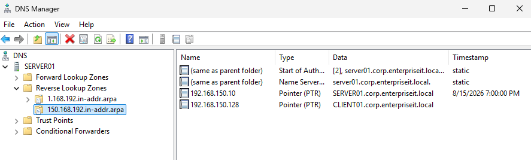

### DNS CNAME Alias

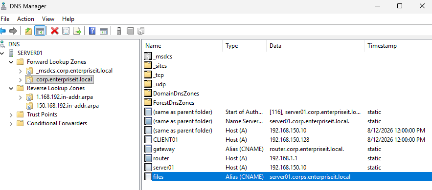

### DNS Aging and Scavenging

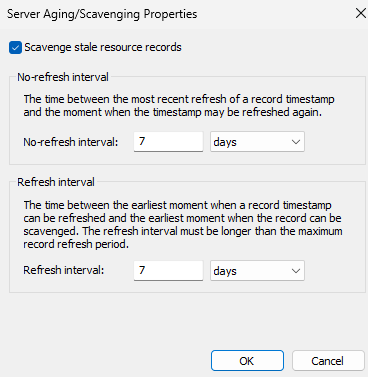

### DHCP Server Role Installation

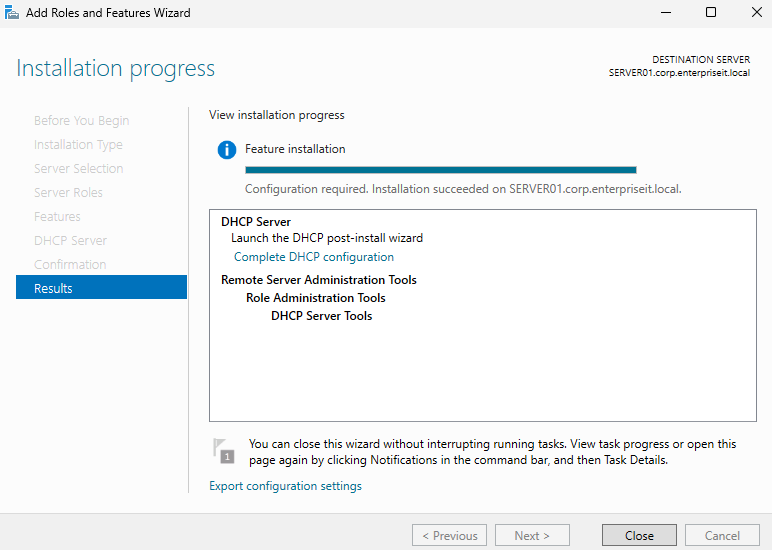

### DHCP Post-Installation Authorization

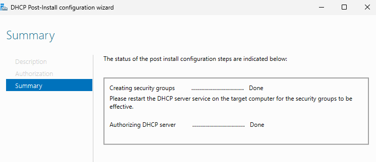

### DHCP Scope Before Activation

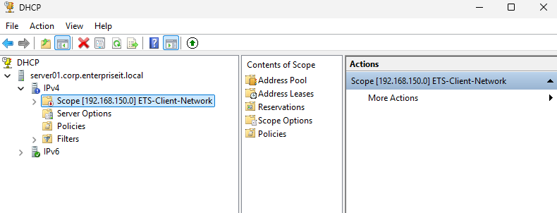

### VMware DHCP Disabled

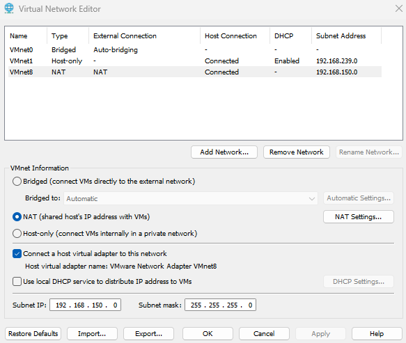

### Windows DHCP Scope Active

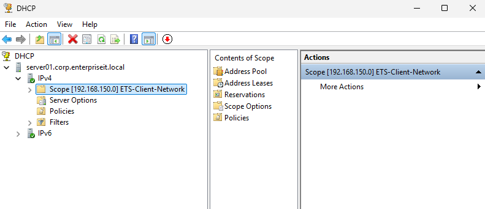

### CLIENT01 Windows DHCP Lease

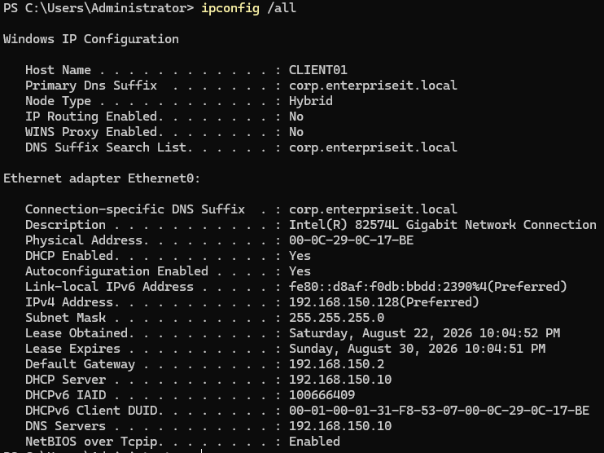

### CLIENT01 DHCP Reservation

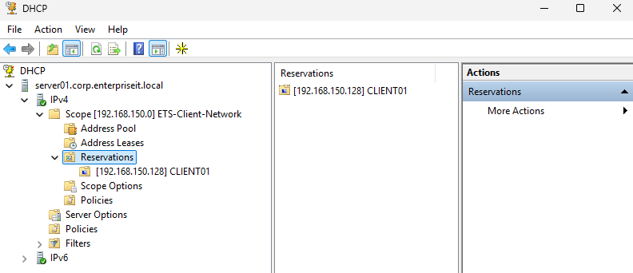

### DHCP/DNS Integration

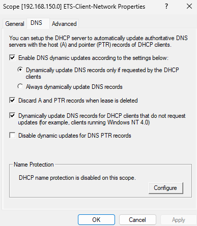

### DHCP Scope Options

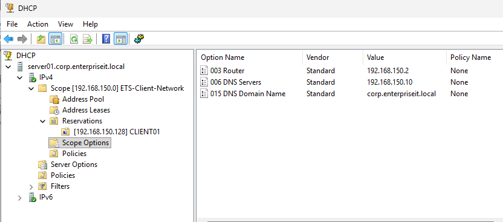

### Final DNS Configuration

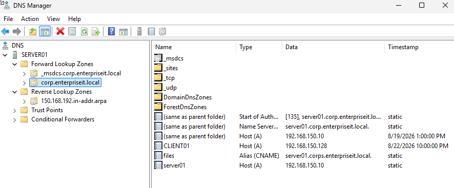

### Active CLIENT01 DHCP Reservation

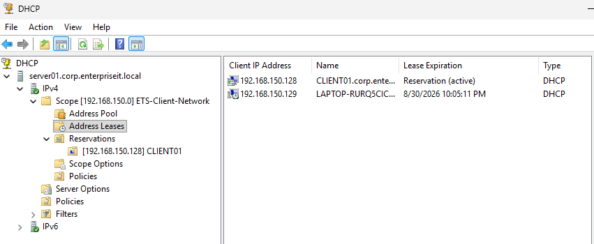

## 9. Key Takeaways

- Active Directory depends on DNS for domain-controller and service discovery.
- Forward DNS maps names to addresses, while reverse DNS maps addresses back to names.
- PTR records provide reverse-resolution information.
- CNAME records provide aliases that can separate service names from server hostnames.
- Active Directory-integrated DNS stores domain DNS information within Active Directory.
- Secure dynamic updates restrict dynamic DNS registration to authenticated domain participants.
- DNS aging and scavenging help control stale dynamically registered records.
- DHCP centralizes IP address and network-option administration.
- DHCP exclusions protect addresses within a scope from dynamic allocation.
- DHCP reservations provide predictable client addresses without requiring static client configuration.
- DHCP options distribute gateway, DNS server, and DNS suffix information.
- Active Directory authorization helps prevent unauthorized Windows DHCP servers from servicing domain networks.
- DHCP and DNS can work together to maintain client name-resolution records.
- Competing DHCP servers should not be allowed to serve the same client network unintentionally.
- Infrastructure migrations should preserve rollback capability and validate dependent services before legacy configuration is removed.

## 10. Administrator Reflection

This module demonstrated that DNS and DHCP are closely connected to nearly every other Windows infrastructure service.

The most important architectural lesson was that DNS is not simply a convenience for translating names into IP addresses. Active Directory relies on DNS to locate domain controllers and services, making DNS configuration part of the identity infrastructure itself.

The DHCP migration also demonstrated the importance of controlled infrastructure changes. Windows DHCP could not simply be activated while VMware DHCP remained available. The migration required the replacement service to be prepared first, the competing service to be disabled, and the new service to be activated in a deliberate sequence.

The reservation exercise reinforced the distinction between configuring an administrative object and confirming that the client is actually using it. A reservation existing in DHCP Manager did not by itself prove that CLIENT01 was consuming the reserved lease.

The removal of obsolete DNS records demonstrated another important operational responsibility: infrastructure changes are not complete when the new configuration merely works. Administrators must also identify and remove legacy configuration that no longer represents the environment.

In a production enterprise environment, DNS and DHCP administration would additionally require redundancy, multiple DNS and DHCP servers, DHCP failover, monitoring and alerting, formal IP address management, backup and recovery procedures, security review, change approval, capacity planning, and documented disaster-recovery procedures.

## Outcome

Enterprise DNS and DHCP services are active on `SERVER01` for the Enterprise Technology Solutions Windows lab.

The completed implementation provides:

- Active Directory-integrated name resolution.
- Forward and reverse DNS resolution.
- Service-oriented DNS aliasing.
- DNS aging and scavenging.
- Active Directory-authorized Windows DHCP.
- Centrally managed client addressing.
- DHCP exclusions and reservations.
- Standardized gateway, DNS, and domain configuration.
- DHCP/DNS integration.
- Removal of obsolete DNS configuration.
- Continued operation of Active Directory and Windows file services after the network-services migration.

The final environment successfully transitioned DHCP responsibility from VMware to Windows Server while preserving VMware NAT and the established Active Directory infrastructure.